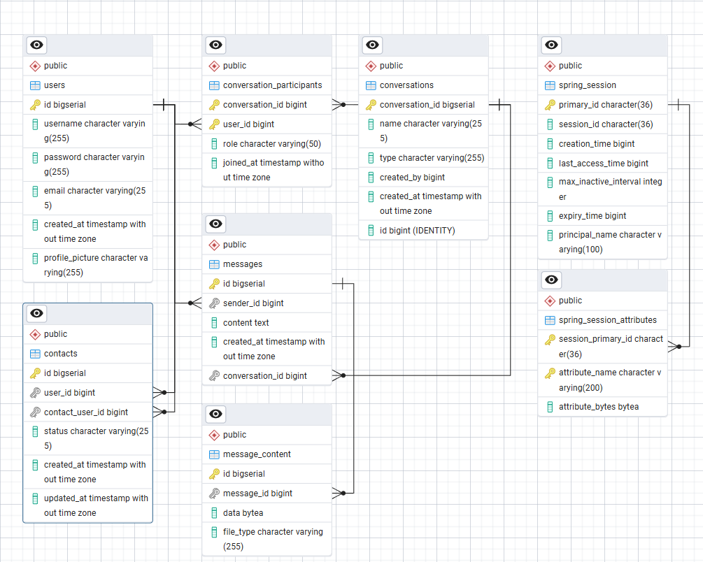
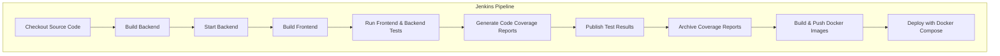

# Ohjelmistotuotantoprojekti

```contributors
Tony Karlin, Onni Kivinen, Joni Heikkilä, Jarkko Kärki
```

## Description

Our project is designed to help users easily add contacts and chat with them.

## Features

- **Client (JavaFX)**

  - Create users
  - Add users as contacts
  - Create conversations
  - Chat with your contacts

- **Backend (Java / Spring Boot)**
  - User authentication and authorization
  - Manage user profiles and contacts
  - Create and manage conversations
  - Store and retrieve chat messages
  - Real-time message handling (to be implemented in the future)

## Rough Project Structure

```project-structure
Backend/ # Java Spring Boot backend
├─ database/            # Database initialization
├─ http-requests/       # HTTP request snippets for manual testing -
├─ src/                 # (VS Code REST Client, Postman, curl)
│ ├─ main/
│ │ ├─ java/
│ │ │ └─ backend_api/
│ │ │  ├─ controller/    # REST & WebSocket controllers
│ │ │  ├─ DTOs/          # Data Transfer Objects for users, messages, conversations
│ │ │  ├─ entities/      # Database entities
│ │ │  ├─ repository/    # Spring Data repositories
│ │ │  ├─ services/      # Business logic services
│ │ │  └─ utils/         # Utilities (JWT, exception handling, etc.)
│ │ └─ resources/
│ │ └─ application.properties
│ └─ test/              # Unit and integration tests
├─ Dockerfile
└─ pom.xml

Frontend/ # JavaFX client
├─ src/
│ ├─ main/
│ │ ├─ java/
│ │ │ ├─ controller/    # UI controllers
│ │ │ ├─ view/          # JavaFX views (FXML files)
│ │ │ ├─ model/         # Domain models (User, Message, Contact, Conversation)
│ │ │ └─ service/       # API clients to interact with backend
│ │ └─ resources/       # FXML files, CSS, images
│ └─ test/              # Client tests
├─ Dockerfile
└─ pom.xml

docs/ # Project documentation (plans, database diagrams, sprint reports)
├─ images/
├─ project-initialization/
└─ sprint-documentation/

docker-compose.yml      # Orchestrates frontend, backend, and database containers
Jenkinsfile             # CI/CD pipeline configuration
```

## Frontend

The frontend is built with Java and JavaFX that allows users to communicate with their contacts.

## Backend

The backend of the project is built with Java and Spring Boot, using Maven as the build tool. It handles the business logic and data storage, using PostgreSQL as the primary database, and provides a RESTful API that the frontend client uses to make HTTP requests.

## Database

Initial database Schema in PostGreSQL.



## Jenkins CI/CD

Jenkins is currently handled locally since the backend has not yet been integrated into a remote server, which we believe will be implemented in the next course.

### General flow of the pipeline



Currently there are three docker images for the project. One for the Frontend (Client), one for the Backend (Springboot Server) and one for the database (PostgreSQL).

## Testing

Testing is performed on both the backend and frontend components of the project.

### Backend Testing

- **Unit Tests:** The backend uses JUnit and Mockito to test individual services, controllers, and repositories. These tests verify business logic, data validation, and API endpoints.
- **Integration Tests:** Integration tests ensure that different modules work together, including database interactions and REST API responses.
- **Test Coverage:** Code coverage is measured using tools like JaCoCo, and reports are generated in the CI/CD pipeline.

### Frontend Testing

- **Unit Tests:** The frontend includes JUnit-based tests for controllers and models to validate UI logic and data handling.
- **Manual Testing:** JavaFX UI components are manually tested to ensure correct user interaction and display.
- **End-to-End Testing:** Basic end-to-end scenarios are tested by running the client against the backend to verify user flows such as login, contact management, and messaging.

All tests are executed automatically in the Jenkins pipeline, with results and coverage reports archived for review.

## Docker Image

```yaml
docker-compose up -d
```

## Future development

- Implement live chatting and possible voice calls.
- Public walls where any user can join by a specific topic and chat about.
- Localization (multiple language options).
- Calendar for planning events and meetings.
- Pinning messages.
- Live Notifications for alerts etc.
