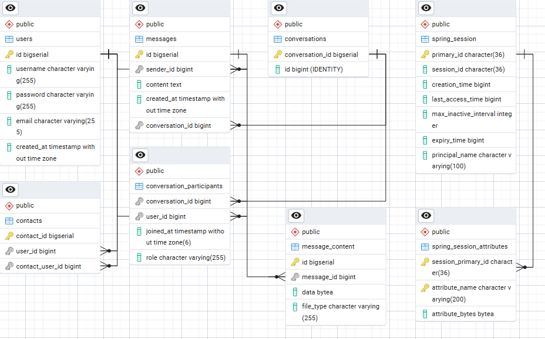

# Ohjelmistotuotantoprojekti

```contributors
Tony Karlin, Onni Kivinen, Joni Heikkilä, Jarkko Kärki
```

## Description

Our project is designed to help users easily add contacts and chat with them.

## Features

- **Client (JavaFX)**

  - Create users
  - Add users as contacts
  - Create conversations
  - Chat with your contacts

- **Backend (Java / Spring Boot)**
  - User authentication and authorization
  - Manage user profiles and contacts
  - Create and manage conversations
  - Store and retrieve chat messages
  - Real-time message handling (to be implemented in the future)

## Rough Project Structure

```project-structure

docs/ # Project documentation (plans, database diagrams, sprint reports)
├─ database/
├─ project-initialization/
└─ sprint-documentation/

Backend/ # Java Spring Boot backend
├─ src/
│ ├─ main/
│ │ ├─ java/
│ │ │ └─ backend_api/
│ │ │ ├─ controller/    # REST & WebSocket controllers
│ │ │ ├─ DTOs/          # Data Transfer Objects for users, messages, conversations
│ │ │ ├─ entities/      # Database entities
│ │ │ ├─ repository/    # Spring Data repositories
│ │ │ ├─ services/      # Business logic services
│ │ │ └─ utils/         # Utilities (JWT, exception handling, etc.)
│ │ └─ resources/
│ │ └─ application.properties
│ └─ test/              # Unit and integration tests
├─ Dockerfile
└─ pom.xml

Frontend/ # JavaFX client
├─ src/
│ ├─ main/
│ │ ├─ java/
│ │ │ ├─ controller/    # UI controllers
│ │ │ ├─ view/          # JavaFX views (FXML files)
│ │ │ ├─ model/         # Domain models (User, Message, Contact, Conversation)
│ │ │ └─ service/       # API clients to interact with backend
│ │ └─ resources/       # FXML files, CSS, images
│ └─ test/              # Client tests
├─ Dockerfile
└─ pom.xml

docker-compose.yml      # Orchestrates frontend, backend, and database containers
Jenkinsfile             # CI/CD pipeline configuration
```

## Frontend

The frontend is built with Java and JavaFX that allows users to communicate with their contacts.

## Backend

The backend of the project is built with Java and Spring Boot, using Maven as the build tool. It handles the business logic and data storage, using PostgreSQL as the primary database, and provides a RESTful API that the frontend client uses to make HTTP requests.

## Database

Initial database Schema in PostGreSQL.



## JaCoCo report

Java Code Coverage reports for both Backend and Frontend directories.

```powershell
cd .\Frontend; mvn clean test jacoco:report
```

```powershell
cd .\Backend; mvn clean test jacoco:report
```

The JaCoCo reports can be found in the `target/site/jacoco` directory within each respective project.

## Image

docker-compose up --build
docker-compose down
